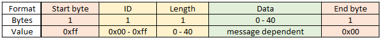
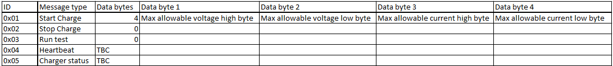

# Charger Box Firmware
#### Michael Jones 2023

## Development
Development done using Microchip Studio → open the `.atsln` file. I didn't
bother figuring out how to integrate git with Microchip Studio, so I just
add the files separately from the command line.

I created `terminal.py` as a handy little debugging tool. It can handle the
USB COM port disconnecting/reconnecting, which happens every time you re-program
the board. 

## Serial Port Message Structure
The messages sent over the serial port conform to this structure:

And the types of messages sent include (currently an incomplete table):

The charger board acts as a USB CDC device. For this class of device, error
detection is performed via CRC, but there is not necessarily a guarantee of
delivery (especially if buffers fill up to quickly). The data received will be
correct, but some bytes may be dropped (in my experience I've seen this happen
when spamming the serial port with lots of messages). This can be detected by
comparing the length field with the actual length of the message. If a byte
is dropped, that message is lost. Re-sending of messages is up to the
application.

An advantage of using `0xff` as the start byte is that it is a non-ASCII
character. Therefore, any ASCII debug/print statements can be safely ignored
(or passed through to the user interface to provide additional informational
messages that contain lots of text).